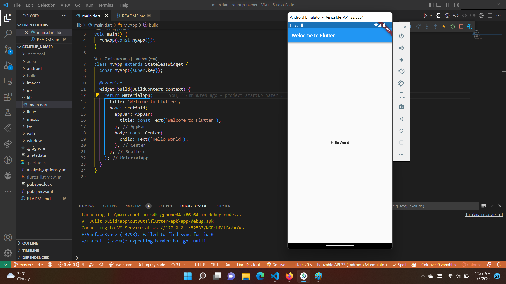
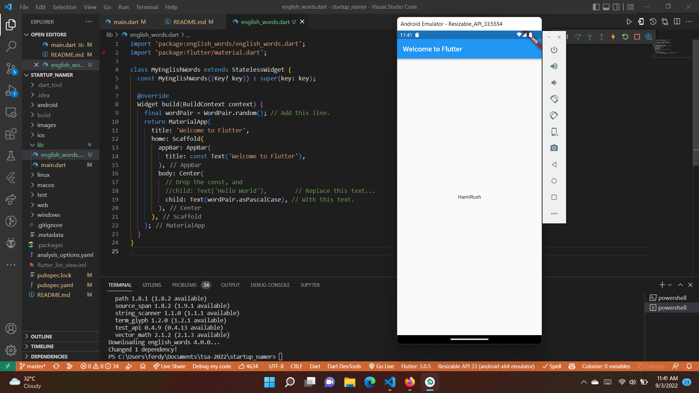
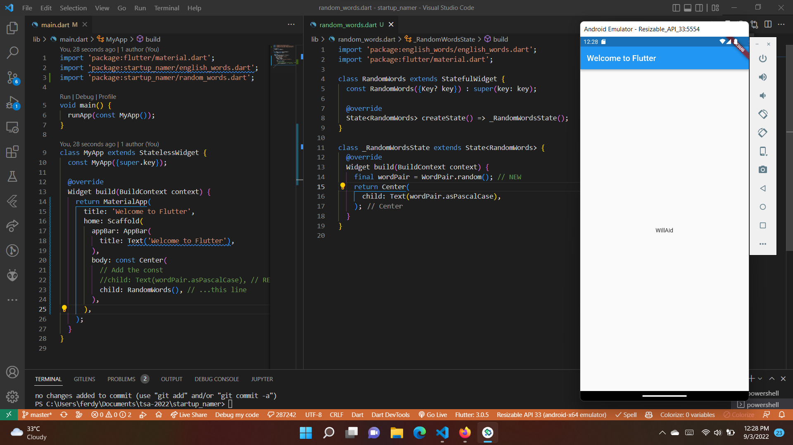
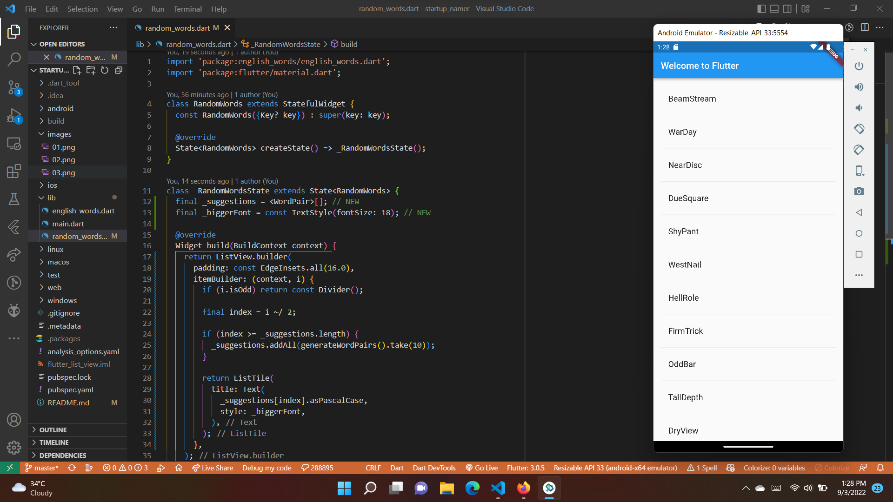

# EVALUASI PROJECT MINGGU 4

[Link Praktikum](https://codelabs.developers.google.com/codelabs/first-flutter-app-pt1#0)

## Praktikum 1: Create the starter Flutter app



* Disini kita membuat project flutter baru, dengan nama startup_namer. 

## Praktikum 2: Use an external package



* Pada langkah ini, kita ingin menambahkan package yang bernama english_words.
* Kita dapat menemukan banyak package di pub.dev.
* Jalan pertama untuk menambahkan package adalah dengan menambahkan dependensi di pubspec.yaml. atau dengan perintah 

```
flutter pub add english_words
```

* Kemudian import library pada lib/main.dart

```dart
import 'package:english_words/english_words.dart';
```

## Praktikum 3: Add a stateful widget



* Pada langkah ini kita akan membuat stateful widget.
* Stateful widget adalah widget yang memiliki state yang dapat berubah.
* Pada contoh ini kita akan membuat stateful widget yang akan menampilkan kata-kata secara acak.
* WordPair adalah class yang akan kita gunakan untuk menampilkan kata-kata secara acak.
* Pada class RandomWordsState kita akan membuat state untuk menampung kata-kata yang sudah ditampilkan.
* asPascalCase adalah method yang akan mengubah kata menjadi PascalCase.

## Praktikum 4: Create an infinite scrolling ListView



* ListView adalah widget yang akan menampilkan list item secara vertikal.
* _suggestions adalah list yang akan menampung kata-kata yang sudah ditampilkan.
* _biggerFont adalah method yang akan mengubah ukuran font.
* itemBuilder: (context, i) adalah method yang akan menampilkan item pada list.
* isOdd adalah method yang akan mengecek apakah i ganjil atau genap.
* Divider() adalah widget yang akan menampilkan garis pemisah.
* index ~/ 2 adalah method yang akan mengembalikan hasil bagi i dengan 2.
* take(10) adalah method yang akan mengambil 10 item dari list.
* generateWordPairs() adalah method yang akan mengembalikan list kata-kata secara acak.
* addAll() adalah method yang akan menambahkan list ke list lainnya.
* ListTile adalah widget yang akan menampilkan item pada list.
* _suggestions[index] adalah method yang akan mengambil kata-kata pada list _suggestions.


