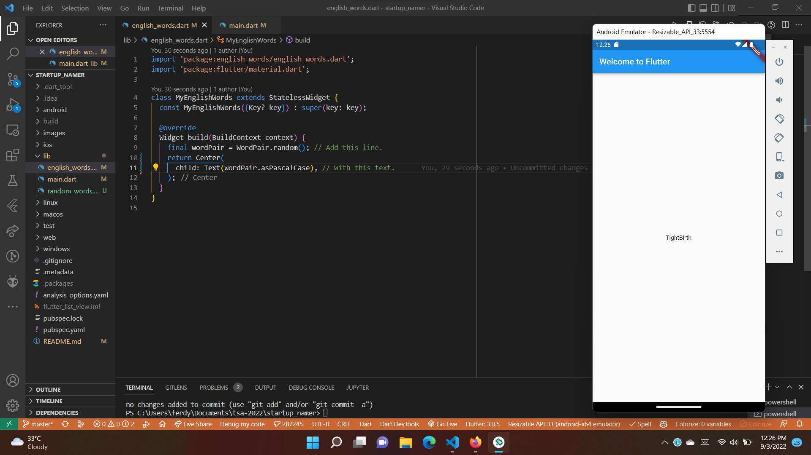

# EVALUASI PROJECT MINGGU 4

[Link Praktikum](https://codelabs.developers.google.com/codelabs/first-flutter-app-pt1#0)

## Praktikum 1: Create the starter Flutter app


* Disini kita membuat project flutter baru, dengan nama startup_namer. 

## Praktikum 2: Use an external package



* Pada langkah ini, kita ingin menambahkan package yang bernama english_words.
* Kita dapat menemukan banyak package di pub.dev.
* Jalan pertama untuk menambahkan package adalah dengan menambahkan dependensi di pubspec.yaml. atau dengan perintah 

```
flutter pub add english_words
```

* Kemudian import library pada lib/main.dart

```dart
import 'package:english_words/english_words.dart';
```

## Praktikum 3: Add a stateful widget


